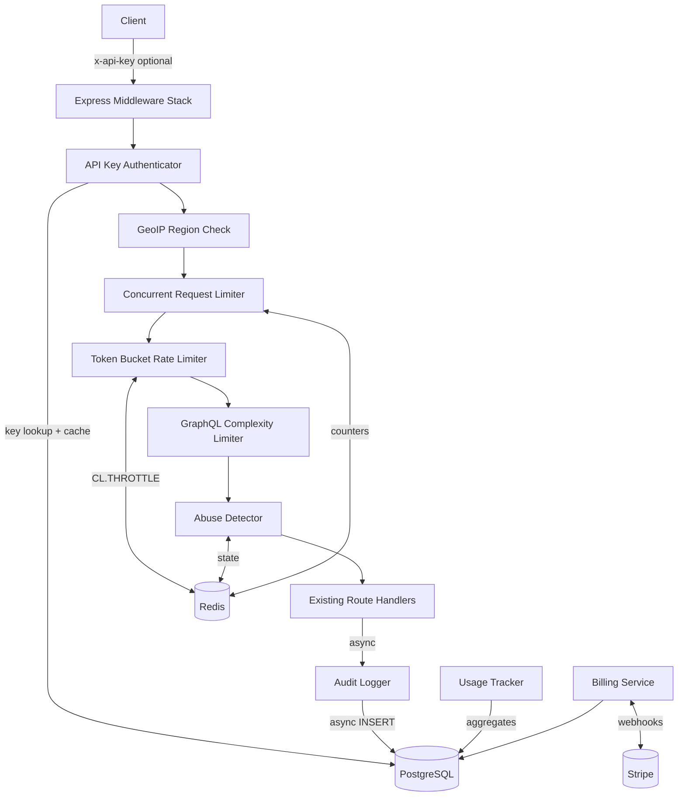

# Design Document: API Authentication and Distributed Rate Limiting

## Overview

This feature adds API authentication, distributed rate limiting, and a supporting management layer to the Soroban Smart Block Explorer REST API. The backend is a Node.js/Express application (the `indexer` service) that already has Redis and PostgreSQL available via Docker Compose.

The design inserts an authentication/rate-limiting middleware stack at the Express router level, adds PostgreSQL tables for API key management and audit logging, adds Redis key namespaces for token buckets and abuse detection state, integrates with Stripe for billing, adds a GraphQL complexity limiter, and delivers a React/TypeScript analytics dashboard to the frontend.

All existing endpoints remain functional for unauthenticated clients subject to the Unauthenticated tier limits, preserving backward compatibility.

---

## Architecture

### System Context



### Middleware Execution Order

Each inbound HTTP request passes through this ordered middleware chain before reaching the existing route handlers:

1. `apiKeyAuthenticator` — resolves client identity and tier
2. `geoIpRateLimiter` — blocks or multiplies limits by region
3. `concurrentRequestLimiter` — enforces in-flight cap per key
4. `tokenBucketRateLimiter` — applies per-tier, per-endpoint token bucket
5. `graphqlComplexityLimiter` — rejects expensive GraphQL queries (GraphQL routes only)
6. `abuseDetector` — pattern analysis and automatic penalties
7. `rateLimitHeaderWriter` — attaches `X-RateLimit-*` headers on every response
8. Existing route handlers (unmodified)
9. `auditLogger` (response-finish hook, async, non-blocking)

---

## Components and Interfaces

### 1. API Key Authenticator (`src/auth/apiKeyAuth.js`)

Responsibilities:
- Extract `x-api-key` header or fall back to client IP identity.
- Look up key record in PostgreSQL; use a short-lived in-memory LRU cache (TTL 30 s, max 1 000 entries) to avoid per-request DB hits.
- Validate: not revoked, not expired, IP CIDR whitelist, endpoint whitelist.
- Attach a `req.rateContext` object consumed by downstream middleware.

```js
// req.rateContext shape
{
  clientId: string,       // key prefix or hashed IP
  tier: 'unauthenticated' | 'free' | 'pro' | 'enterprise',
  rateLimit: number | null,  // per-key override if set
  keyId: string | null,
  keyName: string | null,
}
```

Error responses:
- `401 { "error": "Invalid API key" }` — unrecognised key
- `401 { "error": "API key expired" }` — past `expires_at`
- `401 { "error": "API key revoked" }` — `revoked = true`
- `403 { "error": "IP not permitted" }` — CIDR mismatch
- `403 { "error": "Endpoint not permitted" }` — endpoint mismatch

### 2. Token Bucket Rate Limiter (`src/rateLimit/tokenBucket.js`)

Uses the Redis `CL.THROTTLE` command (RedisBloom / redis-cell module) which implements the GCRA (Generic Cell Rate Algorithm), a leaky-bucket variant compatible with token-bucket semantics.

Fallback: if Redis is unreachable, falls back to an in-process `Map<clientId, {tokens, lastRefill}>` limiter and emits a `warn` log.

```
CL.THROTTLE <key> <max_burst> <count_per_period> <period_seconds> [<quantity>]
Key format: rl:{clientId}:{endpointGroup}
```

Tier configuration (sourced from `RATE_LIMIT_CONFIG` env / default constants):

| Tier            | Sustained (rpm) | Burst | TTL    |
|-----------------|-----------------|-------|--------|
| Unauthenticated | 60              | 10    | 1 h    |
| Free            | 1 000           | 50    | 24 h   |
| Pro             | 10 000          | 200   | 1 month|
| Enterprise      | configurable    | configurable | configurable |

Endpoint group rate limits are enforced via separate buckets per endpoint group. Groups and their limits are defined in `src/rateLimit/endpointGroups.js`.

Response on exhaustion: `429` with `Retry-After: <seconds>` and the full `X-RateLimit-*` header set.

### 3. Rate Limit Header Writer (`src/rateLimit/headers.js`)

Attaches these headers to every response (success or error):

| Header | Value |
|--------|-------|
| `X-RateLimit-Limit` | max rpm for active tier + endpoint group |
| `X-RateLimit-Remaining` | remaining tokens in current window |
| `X-RateLimit-Reset` | Unix timestamp of next window reset |
| `X-RateLimit-Tier` | tier name string |
| `Retry-After` | seconds until next token (429 only) |

### 4. Concurrent Request Limiter (`src/rateLimit/concurrentLimiter.js`)

Uses Redis `INCR` / `DECR` on keys `conc:{clientId}` with a short TTL safety net. On request start: INCR and check against tier cap. On response finish (including errors): DECR.

Limits by tier: Unauthenticated 5, Free 20, Pro 100, Enterprise configurable.

WebSocket connections are tracked separately under `conc:ws:{clientId}` with limits: Unauthenticated 1, Free 5, Pro 25.

Returns `503 { "error": "Too many concurrent requests" }` with `Retry-After: 1` when cap exceeded.

### 5. GraphQL Complexity Limiter (`src/rateLimit/graphqlComplexity.js`)

Applied only to GraphQL endpoints. Parses the query body, walks the AST, and calculates total cost as the sum of field costs multiplied by list multipliers.

Cost budgets by tier: Unauthenticated 100, Free 500, Pro 2 000, Enterprise configurable.

On rejection: `400 { "error": "Query complexity exceeded", "cost": N, "limit": M }`.

Headers added: `X-GraphQL-Cost`, `X-GraphQL-Cost-Remaining`.

### 6. GeoIP Rate Limiter (`src/rateLimit/geoIpLimiter.js`)

Resolves client IP to a country/region code using the `maxmind` npm package with the GeoLite2-Country database file (path from `GEOIP_DB_PATH` env).

- If region in `GEO_BLOCK_LIST` (comma-separated env): return `403 { "error": "Region not permitted" }`.
- If region in `GEO_RATE_MULTIPLIERS` (JSON env): multiply the tier's base limit by the configured factor before passing to the token bucket.

### 7. Abuse Detector (`src/rateLimit/abuseDetector.js`)

Implements five detection patterns, all persisting state in Redis for cross-instance consistency:

| Pattern | Detection | Action |
|---------|-----------|--------|
| Auth brute-force | >10 auth failures per IP in 60 s | Block IP 15 min, set `captcha_required` flag |
| Scraping | >200 rpm + URL similarity >0.9 | Reduce effective limit to 10% for 10 min |
| DDoS | >50 distinct IPs to same endpoint in 10 s | Trigger alert + Cloudflare webhook |
| Aggressive pagination | >20 consecutive pages in 60 s | Penalty: 5 rpm on endpoint for 5 min |
| Repeat offender | >5 rate limit breaches in 10 min | Flag key as suspicious, emit structured warning log |

URL similarity scoring uses Jaccard similarity on URL path token sets.

### 8. Key Manager (`src/admin/keyManager.js`)

CRUD service for `api_keys` table. Admin authentication via `ADMIN_SECRET` environment variable checked in `src/admin/adminAuth.js` middleware.

Admin routes mounted at `/api/admin/`:

| Method | Path | Description |
|--------|------|-------------|
| GET | `/api/admin/api-keys` | Paginated list (excludes `key_hash`) |
| POST | `/api/admin/api-keys` | Create key, return raw key once |
| PATCH | `/api/admin/api-keys/:id` | Update metadata/tier/revoked |
| DELETE | `/api/admin/api-keys/:id` | Soft delete (set revoked=true) |
| POST | `/api/admin/api-keys/:id/rotate` | Re-generate key, return new raw key once |
| GET | `/api/admin/api-keys/:id/usage` | Daily usage history |
| GET | `/api/admin/audit-log` | Filtered, paginated audit search |
| GET | `/api/admin/audit-log/export` | CSV or JSON export |

Key generation uses `crypto.randomBytes(32)` encoded as URL-safe base64. The raw key is hashed with `bcrypt` (cost factor 12) before storage.

### 9. Usage Tracker (`src/usage/usageTracker.js`)

Aggregates per-key metrics in Redis counters and flushes to `api_key_usage_daily` PostgreSQL table every minute via a cron job.

Tracked per key per day:
- `total_requests`
- `endpoint_distribution` (JSONB map of endpoint group → count)
- `data_transfer_mb`
- `rate_limit_hits`
- `peak_concurrent`

Retention: 7 days (Free), 90 days (Pro), 3 years (Enterprise). A nightly cron job runs `DELETE ... WHERE created_at < NOW() - INTERVAL '<retention>'`.

### 10. Billing Service (`src/billing/stripeWebhook.js`)

Webhook endpoint at `POST /api/billing/stripe-webhook`. Verifies Stripe signature using `stripe.webhooks.constructEvent(body, sig, STRIPE_WEBHOOK_SECRET)`.

- `customer.subscription.updated` → update `api_keys.tier` to match plan product metadata.
- `customer.subscription.deleted` → downgrade `api_keys.tier` to `'free'`.

Returns `400` on signature failure; `200` on success.

### 11. Audit Logger (`src/audit/auditLogger.js`)

Writes to `api_audit_log` via a non-blocking async queue (an in-process `AsyncQueue` that batches inserts). The HTTP response is sent before the audit write completes.

### 12. Analytics Dashboard (`frontend/src/pages/RateLimitDashboard.tsx`)

A new page in the React frontend, following the same pattern as `RpcMetricsDashboard.tsx`. Polled at 5-second intervals. Admin-gated: shows a login prompt if `ADMIN_SECRET` is not provided.

Components:
- `RateLimitHitsChart` — real-time line chart (rate limit hits/min)
- `TopUsersTable` — top 20 keys by volume with configurable time window
- `ViolationHeatmap` — hour-of-day × day-of-week violation density
- `UpgradeRecommendations` — keys where 7-day avg > 80% of tier limit

---

## Data Models

### PostgreSQL: `api_keys` table

```sql
CREATE TABLE api_keys (
  id                UUID PRIMARY KEY DEFAULT gen_random_uuid(),
  name              TEXT NOT NULL,
  key_hash          TEXT NOT NULL,
  key_prefix        CHAR(8) NOT NULL,
  tier              TEXT NOT NULL DEFAULT 'free'
                    CHECK (tier IN ('unauthenticated','free','pro','enterprise')),
  rate_limit        INTEGER,                    -- per-key override, nullable
  allowed_ips       JSONB,                      -- CIDR array, nullable
  allowed_endpoints JSONB,                      -- endpoint pattern array, nullable
  expires_at        TIMESTAMPTZ,
  revoked           BOOLEAN NOT NULL DEFAULT FALSE,
  last_used_at      TIMESTAMPTZ,
  usage_count       BIGINT NOT NULL DEFAULT 0,
  created_at        TIMESTAMPTZ NOT NULL DEFAULT NOW(),
  updated_at        TIMESTAMPTZ NOT NULL DEFAULT NOW()
);

CREATE INDEX idx_api_keys_prefix ON api_keys (key_prefix);
CREATE INDEX idx_api_keys_tier ON api_keys (tier);
```

### PostgreSQL: `api_key_usage_daily` table

```sql
CREATE TABLE api_key_usage_daily (
  id                    BIGSERIAL PRIMARY KEY,
  api_key_id            UUID NOT NULL REFERENCES api_keys(id) ON DELETE CASCADE,
  date                  DATE NOT NULL,
  total_requests        BIGINT NOT NULL DEFAULT 0,
  endpoint_distribution JSONB,
  data_transfer_mb      NUMERIC(12,3) NOT NULL DEFAULT 0,
  rate_limit_hits       BIGINT NOT NULL DEFAULT 0,
  peak_concurrent       INTEGER NOT NULL DEFAULT 0,
  UNIQUE (api_key_id, date)
);

CREATE INDEX idx_usage_daily_key_date ON api_key_usage_daily (api_key_id, date DESC);
```

### PostgreSQL: `api_audit_log` table (monthly partitioned)

```sql
CREATE TABLE api_audit_log (
  id                    BIGSERIAL,
  timestamp             TIMESTAMPTZ NOT NULL DEFAULT NOW(),
  api_key_id            UUID,
  key_name              TEXT,
  tier                  TEXT NOT NULL,
  ip                    INET NOT NULL,
  method                TEXT NOT NULL,
  endpoint              TEXT NOT NULL,
  status_code           SMALLINT NOT NULL,
  response_time_ms      INTEGER NOT NULL,
  rate_limit_remaining  INTEGER,
  user_agent            TEXT,
  PRIMARY KEY (id, timestamp)
) PARTITION BY RANGE (timestamp);

-- Initial partitions created by migration; monthly partitions created by cron
CREATE TABLE api_audit_log_y2025m01
  PARTITION OF api_audit_log
  FOR VALUES FROM ('2025-01-01') TO ('2025-02-01');
-- ... additional partitions added monthly by a scheduled cron job
```

A monthly cron job creates the next month's partition and drops partitions older than the configured retention period.

### Redis Key Namespaces

| Namespace | Type | Purpose |
|-----------|------|---------|
| `rl:{clientId}:{endpointGroup}` | CL.THROTTLE | Per-client, per-group token bucket |
| `conc:{clientId}` | String (counter) | Concurrent HTTP request count |
| `conc:ws:{clientId}` | String (counter) | Concurrent WebSocket count |
| `abuse:authfail:{ip}` | String (counter, TTL 60s) | Auth failure count |
| `abuse:block:{ip}` | String (TTL 15min) | IP temporary block flag |
| `abuse:scrape:{clientId}` | Sorted Set | URL path sliding window |
| `abuse:ddos:{endpoint}:{window}` | HyperLogLog | Distinct IPs per endpoint |
| `abuse:paginate:{clientId}:{endpoint}` | String (counter, TTL 60s) | Consecutive page count |
| `abuse:ratelimitcount:{clientId}` | String (counter, TTL 10min) | Repeat breach count |
| `abuse:penalty:{clientId}:{endpoint}` | String (TTL duration) | Penalty flag |
| `usage:{keyId}:{date}:{metric}` | String (counter) | Intra-day usage buffers |

### Environment Variables (new)

| Variable | Description |
|----------|-------------|
| `ADMIN_SECRET` | Bearer token for admin endpoint authentication |
| `RATE_LIMIT_CONFIG` | JSON blob overriding default tier limits |
| `GEO_BLOCK_LIST` | Comma-separated ISO-3166 country codes to block |
| `GEO_RATE_MULTIPLIERS` | JSON map of country code → float multiplier |
| `GEOIP_DB_PATH` | Path to MaxMind GeoLite2-Country.mmdb file |
| `STRIPE_WEBHOOK_SECRET` | Stripe webhook signing secret |
| `STRIPE_SECRET_KEY` | Stripe API key for subscription management |
| `CLOUDFLARE_WEBHOOK_URL` | Optional Cloudflare DDoS mitigation webhook |

---

## Correctness Properties

*A property is a characteristic or behavior that should hold true across all valid executions of a system — essentially, a formal statement about what the system should do. Properties serve as the bridge between human-readable specifications and machine-verifiable correctness guarantees.*

